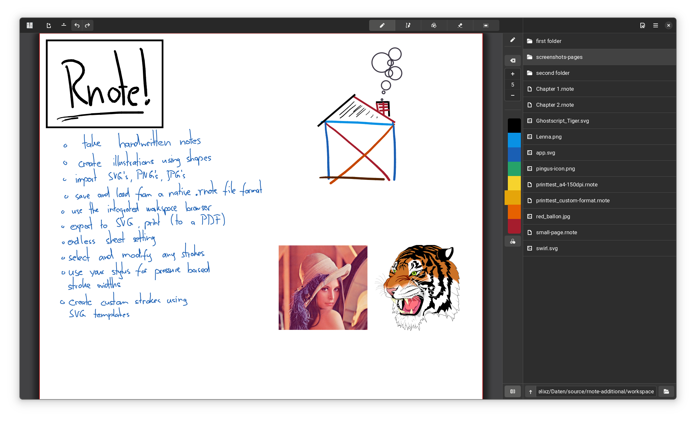
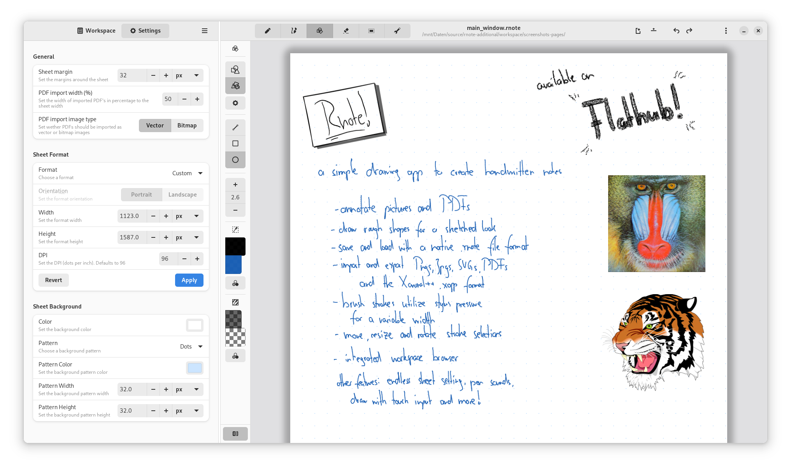
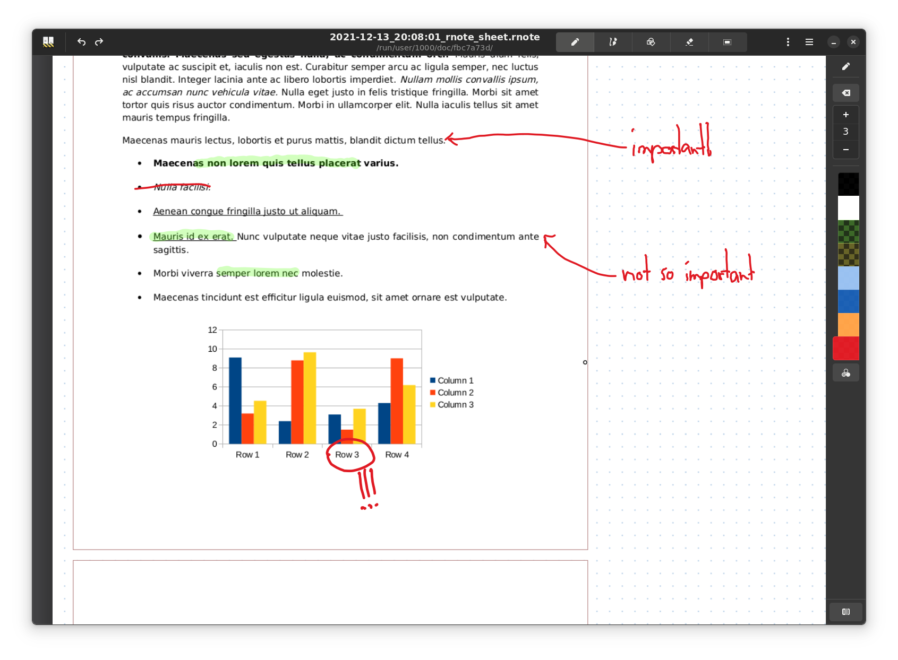
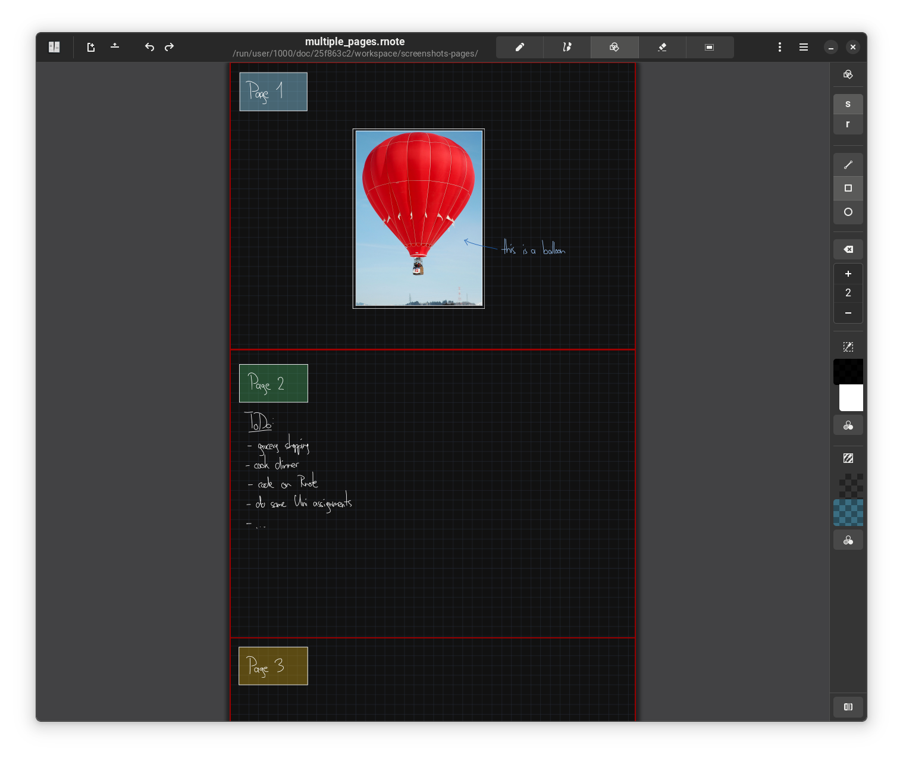
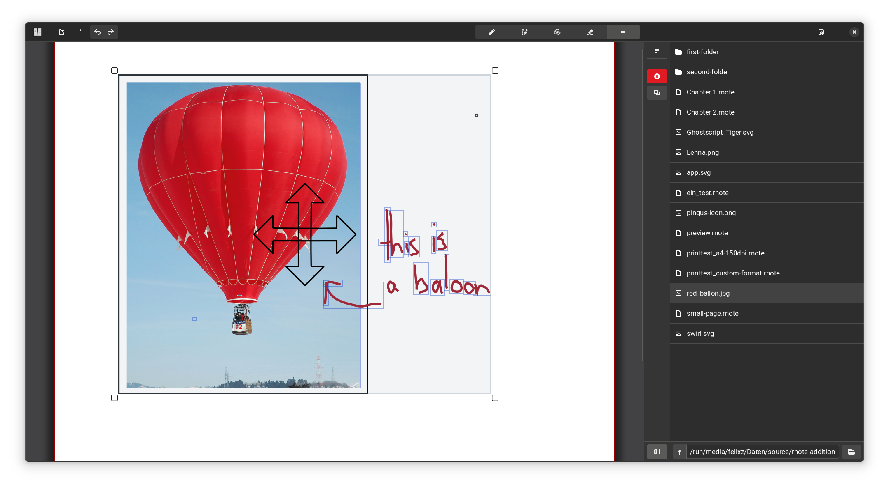

<div align="center">
</img>
</div><br><br><br>

<div align="start">
    <a href="https://liberapay.com/flxzt/donate">
        
    </a>
    <a href="https://www.paypal.com/donate?hosted_button_id=LQ9Q4868GKQGG">
        
    </a>
</div><br>

# Rnote
A simple note taking application written in Rust and GTK4.

Rnote aims to be a simple but functional note taking application for freehand drawing or annotating pictures or documents. It eventually should be able to import / export various media file formats.  
One main consideration is that it is vector based, which should make it very flexible in editing and altering the contents.

**Disclaimer**  
This is my first Rust and GTK project and I am learning as I go along. Expect some bugs and crashes.

## Installation
Rnote is available as  a flatpak on Flathub:

<br><div align="start">
<a href='https://flathub.org/apps/details/com.github.flxzt.rnote'></a>
</div><br>

### Downgrading
Because the file format still is unstable, downgrading to a specific version might be necessary and can be done with:
| version | command |
| --- | --- |
| v0.1.6 | `sudo flatpak update --commit=ffb9781989704f3eb28910437bb26709357566a977178d5fb4ef1a2926edae8b com.github.flxzt.rnote` |
| v0.1.5 | `sudo flatpak update --commit=721f94f5f9806fa1e80d928071e2094a75ba622c7da32bee4af9d8a6c1a82d15 com.github.flxzt.rnote` |

After downgrading, the version can be pinned or unpinned with:
```
$ flatpak mask com.github.flxzt.rnote
$ flatpak mask --remove com.github.flxzt.rnote
```

Then the sheets can be exported as an SVG or PDF and can be re-imported into the newest version of Rnote.

## Screenshots

If you have drawn something cool in Rnote and want to share it, let me know so I can include it as a screenshot. :)







## Pitfalls
* Drag & Drop: Make sure Rnote has permissions to the locations you are dragging files from. Can be granted in Flatseal (a Flatpak permissions manager)

## To-Do
- [x] switch geometry to [nalgebra](https://crates.io/crates/nalgebra) wherever possible. It can operate on f64 and has much more features than graphene.
- [ ] template deduplication when loading in .rnote save files.
- [x] printing & PDF export
- [x] PDF import
- [x] vector & bitmap picture import
- [ ] export as bitmap picture
- [x] implement bezier curve stroke with variable stroke width
    (see [Quadratic bezier offsetting with selective subdivision](https://microbians.com/math/Gabriel_Suchowolski_Quadratic_bezier_offsetting_with_selective_subdivision.pdf),
    [Precise offsetting of bezier curves](https://blend2d.com/research/precise_offset_curves.pdf))
- [ ] (implemented: lines, rectangles, ellipses) drawing rough shapes by porting [rough.js](https://roughjs.com/) to Rust (see `./src/rough-rs`)
- [x] parallelizing rendering and actions which affect many strokes.
- [x] limit rendering to visible strokes based on the current viewport of the canvas ( culling )
- [ ] implement text fields
- [ ] implement optional stroke smoothing

## Feature Ideas:
* Stroke history list widget
    * with the ability to move them up and down the history / layers
* Stroke trash restorer
    *  with a preview of the deleted strokes
* Stylus buttons configuration to map them to different actions and / or pen types 
* Sticky selection: drag along parts of the selected strokes based on the proximity of a round pen tool
* Locked strokes: Selection mode to toggle the mutability of strokes

## File Format
The `.rnote` file format is a gzipped json file. It is (de)compressed with the `flate2` crate and (de)serialized with the `Serde` crate.

So far the first breaking change in the format happened between `v0.1.6` and `v0.2.0`.

Perfect compatibility to future versions is not guaranteed, but from `v0.2.0` on forward there will be efforts to have an upgrade path available inside rnote when opening older files.

To be able to open and export older files that are incompatible with the newest version, look under **Installation** /**Downgrading** to install older versions of Rnote.

# Building, contributing
Build instructions and guidelines how to contribute are outlined in [CONTRIBUTING.md](./CONTRIBUTING.md)