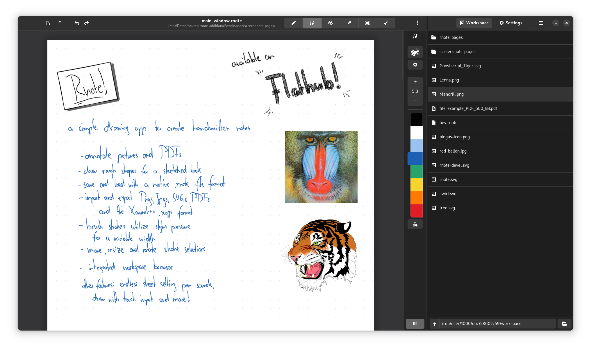
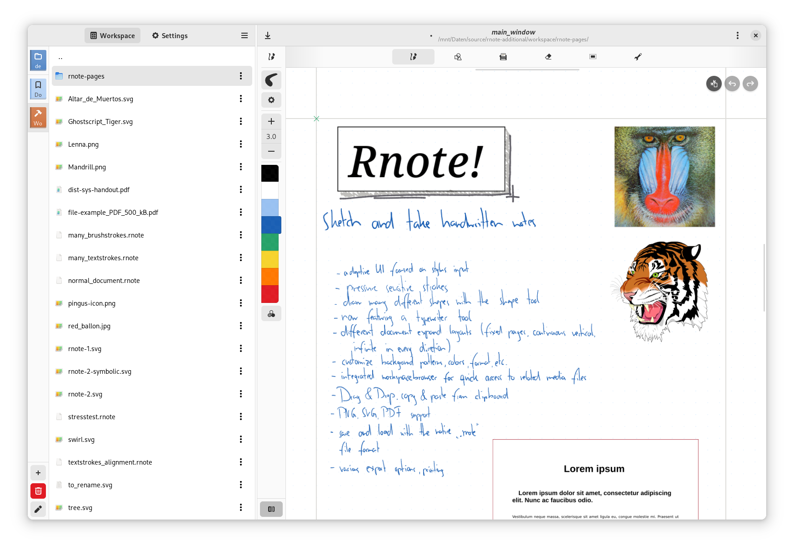
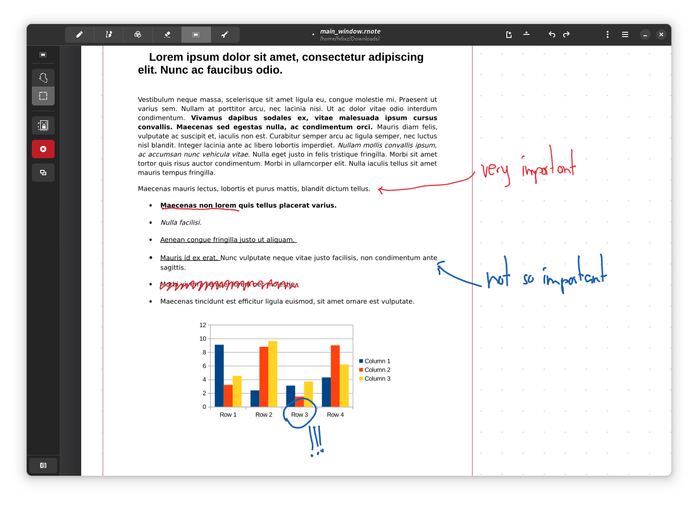
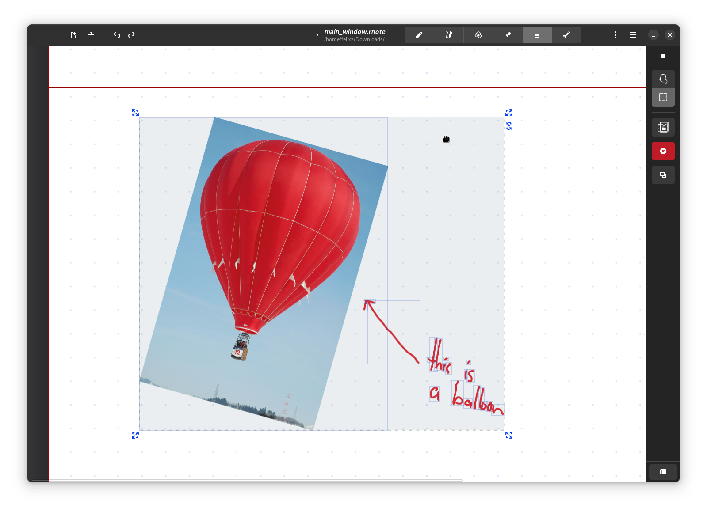

<div align="center">
</img>
</div><br><br><br>

<div align="start">
    <a href="https://liberapay.com/flxzt/donate">
        
    </a>
    <a href="https://www.paypal.com/donate?hosted_button_id=LQ9Q4868GKQGG">
        
    </a>
</div><br>

# Rnote
A simple drawing application to create handwritten notes.  
Written in Rust and GTK4.

Rnote aims to be a simple but functional note taking application for freehand drawing or annotating pictures or documents. It eventually should be able to import / export various media file formats.  
One main consideration is that it is vector based, which should make it very flexible in editing and altering the contents.

**Disclaimer**  
This is my first Rust and GTK project and I am learning as I go along. Expect some bugs and crashes. Also, the file format is still unstable and will change between versions!

## Installation
Rnote is available as a flatpak on Flathub:

<br><div align="start">
<a href='https://flathub.org/apps/details/com.github.flxzt.rnote'></a>
</div><br>

### Downgrading
Because the file format still is unstable, downgrading to a specific version might be necessary and can be done with:
| version | command                                                                                                                |
| ------- | ---------------------------------------------------------------------------------------------------------------------- |
| v0.4.0  | `sudo flatpak update --commit=2ee585842334ad976802f08a1952c3fdc40f6f3afe2e056f3597fe4a029d54d2 com.github.flxzt.rnote` |
| v0.3.5  | `sudo flatpak update --commit=34115ec5896cbe1b7c1b7a589ec2b6da45e9fcbd81ae53c665c08f2fc42bb52f com.github.flxzt.rnote` |
| v0.2.5  | `sudo flatpak update --commit=2036a51c8118a30eb4ceb2e16ba2f84fa8ca4dc814fb88d9424709380093a6c6 com.github.flxzt.rnote` |
| v0.1.6  | `sudo flatpak update --commit=ffb9781989704f3eb28910437bb26709357566a977178d5fb4ef1a2926edae8b com.github.flxzt.rnote` |

After downgrading, the version can be pinned or unpinned with:
```
$ flatpak mask com.github.flxzt.rnote
$ flatpak mask --remove com.github.flxzt.rnote
```

Then the sheets can be exported as an SVG or PDF and can be re-imported into the newest version of Rnote.

## Screenshots






## Pitfalls & known issues
* Drag & Drop: Make sure Rnote has permissions to the locations you are dragging files from. Can be granted in Flatseal (a Flatpak permissions manager)
* odd location for current file: when the directory displayed in the header title is something like `/run/user/1000/../`, rnote does not have permissions to access the directory.
    Again, granting them in Flatseal fixes this issue.

## Community
If you have any questions or want to start a general discussion, open a topic in the [Github Discussions](https://github.com/flxzt/rnote/discussions) section.  
There is also the [#rnote:matrix.org](https://matrix.to/#/#rnote:matrix.org) chat room.  

## File Format
The `.rnote` file format is a gzipped json file. It is (de)compressed with the `flate2` crate and (de)serialized with the `Serde` crate.

So far breaking changes in the format happened in versions:  
- `v0.2.0`
- `v0.3.0`
- `v0.4.0`

To be able to open and export older files that are incompatible with the newest version, look under **Installation** /**Downgrading** to install older versions of Rnote.

## To-Do
- [x] switch geometry to [nalgebra](https://crates.io/crates/nalgebra) wherever possible. It can operate on f64 and has much more features than graphene.
- [x] printing & PDF export
- [x] PDF import ( as vector & bitmap )
- [x] vector & bitmap picture import
- [x] implement bezier curve stroke with variable stroke width
    (see [Quadratic bezier offsetting with selective subdivision](https://microbians.com/math/Gabriel_Suchowolski_Quadratic_bezier_offsetting_with_selective_subdivision.pdf),
    [Precise offsetting of bezier curves](https://blend2d.com/research/precise_offset_curves.pdf))
- [x] Textured brush strokes with tweakable parameters
- [x] Stroke elements drag tool: drag along parts of the selected strokes based on the proximity of a round pen tool
- [x] strokes rotation
- [x] parallelizing rendering and actions which affect many strokes.
- [x] asychronous rendering
- [ ] (partial) Xournal++ .xopp file import and export
- [ ] (implemented: lines, rectangles, ellipses) drawing rough shapes by porting [rough.js](https://roughjs.com/) to Rust
- [ ] cancellable rendering
- [ ] export as bitmap picture
- [ ] text fields (Plain, Markdown)
- [ ] optional stroke smoothing

## Feature Ideas:
* Stroke Layers
* History list
    * with the ability to move them up and down the history
* Stroke trash restorer
    *  with a preview of the deleted strokes
* Stylus buttons configuration to map them to different actions and / or pen types 
* Locked strokes: mode to toggle the mutability of strokes
* Multiple sheet tabs
* Share and synchronize sheets with others ( via e.g. the peer-2-peer protocol libp2p ).

# Drawings created with Rnote

If you have drawn something cool in Rnote and want to share it, submit a PR so it can be showcased here. :)  

<div align="center" spacing="20px">
        
        
        
</div><br>

# Building, contributing
Build instructions and guidelines how to contribute are outlined in [CONTRIBUTING.md](./CONTRIBUTING.md)
