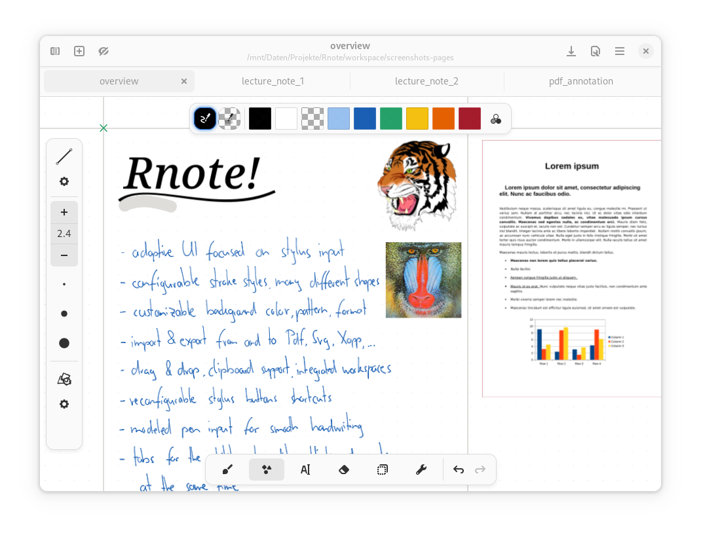
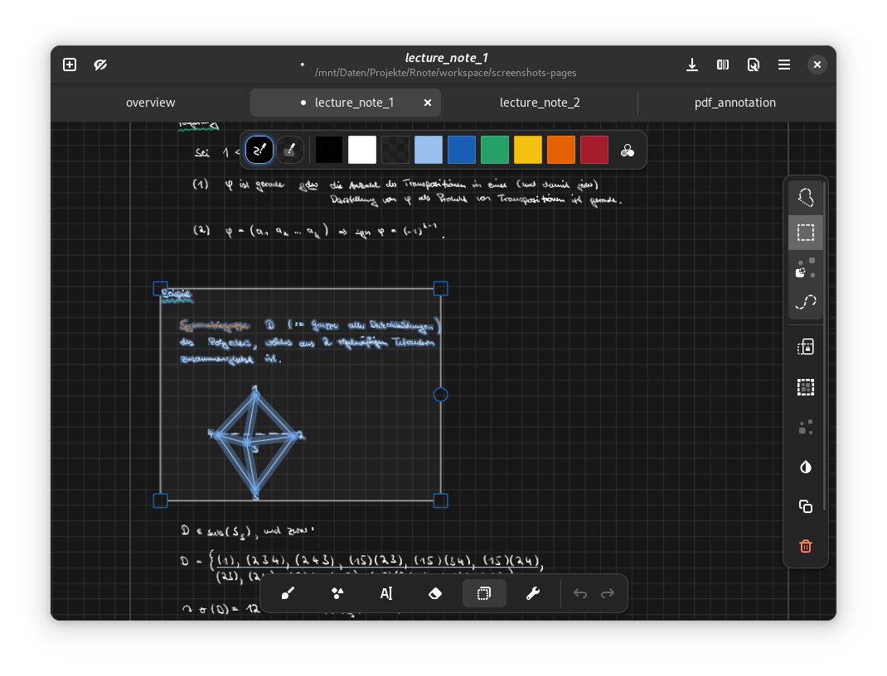
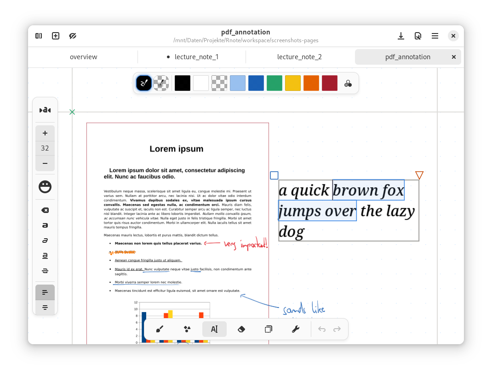
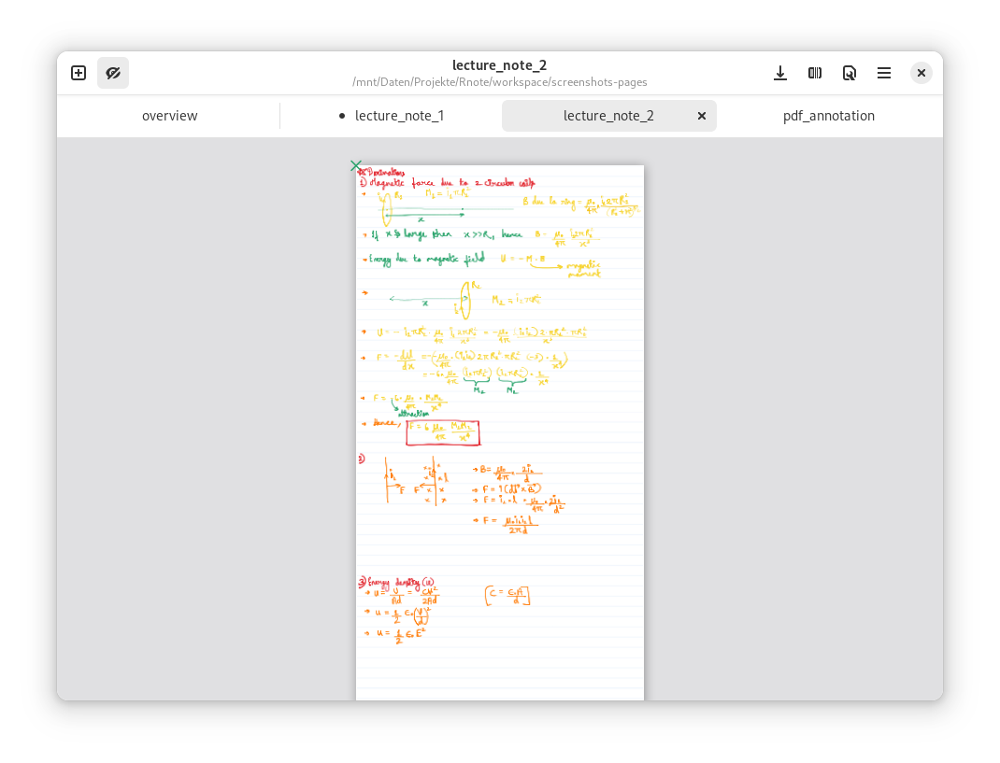
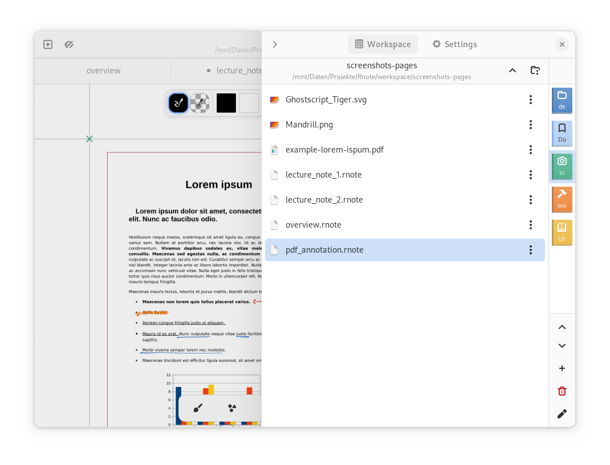
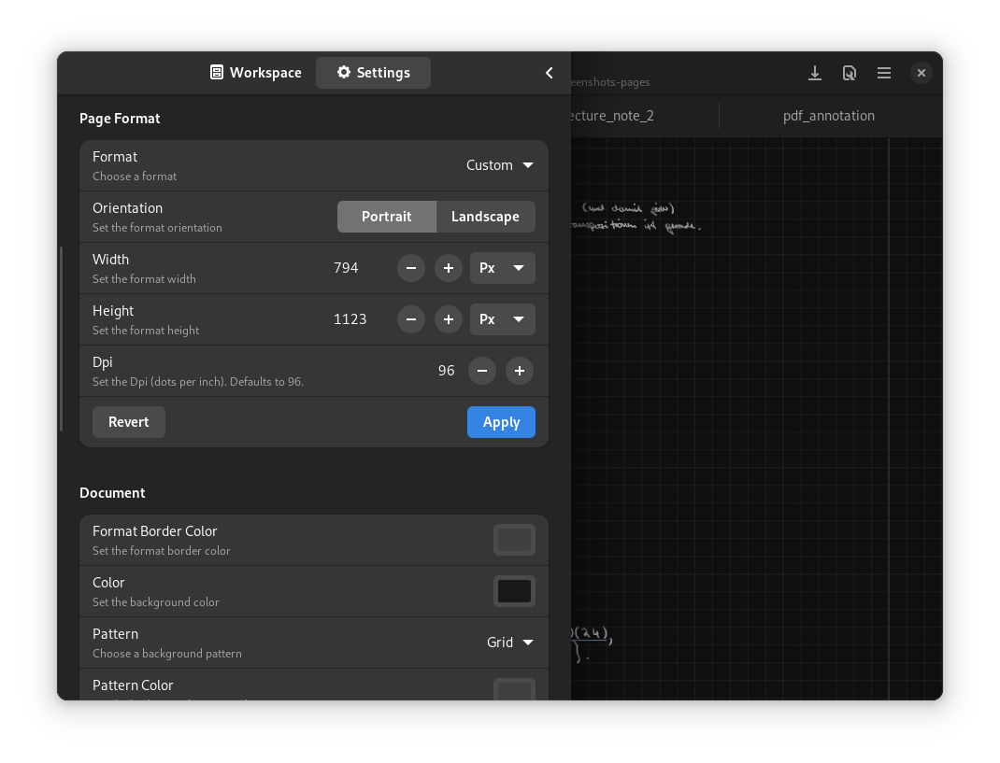
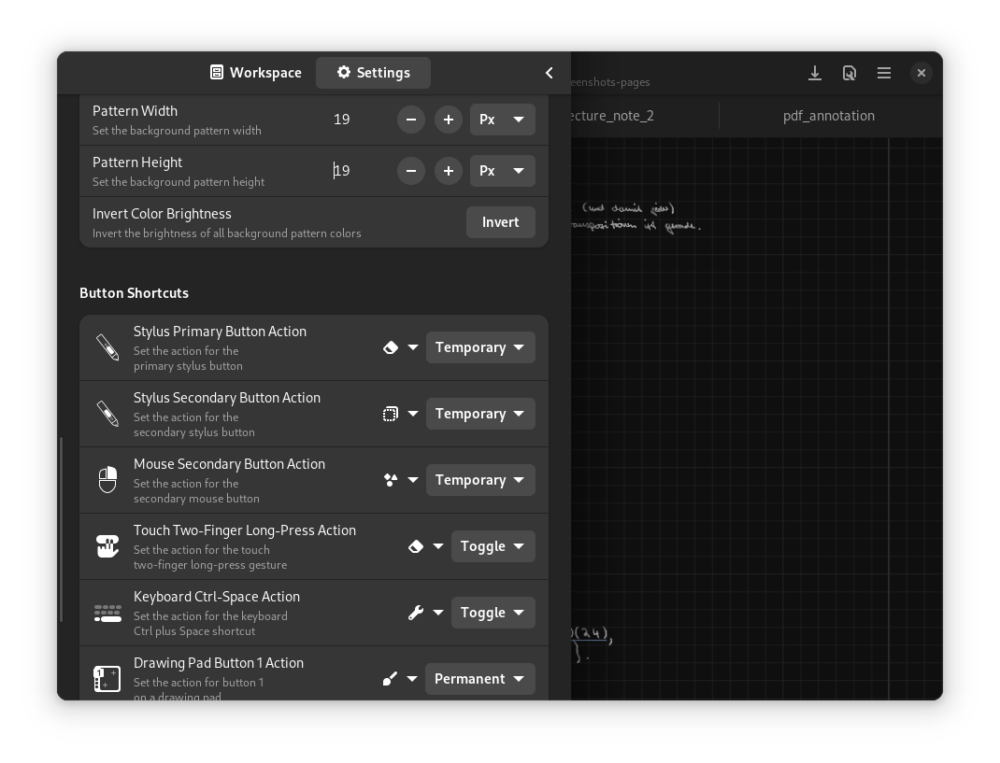

<div align="center">
</img>
</div><br><br><br>

<div align="center">
    <a href="https://github.com/flxzt/rnote/actions/workflows/ci.yml">
        </img>
    </a>
    <a href="https://liberapay.com/flxzt/donate">
        
    </a>
</div>


# Rnote

> Sketch and take handwritten notes.  

Rnote is an open-source vector-based drawing app for sketching, handwritten notes and to annotate documents and pictures.
It is targeted at students, teachers and those who own a drawing tablet and provides features like Pdf and picture import and export,
an infinite canvas and an adaptive UI for big and small screens.

Written in Rust and GTK4.

**Features**

- Adaptive UI focused on stylus input
- Pressure-sensitive stylus input with different and configurable stroke styles
- Create many different shapes with the shape tool
- Move, rotate, resize and modify existing content with the selection tool
- Different document expansion layouts ( fixed pages, continuous vertical, infinite in every direction, .. )
- Customizable background colors, patterns, sizes
- Customizable page format
- (Optional) pen sounds
- Reconfigurable stylus button shortcuts
- An integrated workspace browser for quick access to related files
- Drag & Drop, clipboard support
- Pdf, Bitmap and Svg image import
- Documents can be exported to Svg, Pdf and Xopp. Document pages and selections to Svg, Png and Jpeg.
- Save and load the documents in the native `.rnote` file format
- Tabs to work on multiple documents at the same time
- Autosave, printing

**Disclaimer**

The file format is still unstable. It might change and break compatibility between versions.

## Website

Rnote has a project website: [rnote.flxzt.net](https://rnote.flxzt.net/)

## Installation

### Linux

Download the official flatpak on Flathub [here](https://flathub.org/apps/details/com.github.flxzt.rnote).

<div align="start">
<a href='https://flathub.org/apps/details/com.github.flxzt.rnote'></a>
</div><br>

### MacOS

Thanks to @dehesselle the app is available on MacOS as an app bundle.  
Check out the [repository](https://gitlab.com/dehesselle/rnote_macos), the latest release can be downloaded [here](https://gitlab.com/dehesselle/rnote_macos/-/releases/permalink/latest).

<div align="start">
<a href='https://gitlab.com/dehesselle/rnote_macos/-/releases/permalink/latest'></a>
</div><br>

### Windows

Download the Windows installer from the latest release which can be found [here](https://github.com/flxzt/rnote/releases/latest).

<div align="start">
<a href='https://github.com/flxzt/rnote/releases/latest'></a>
</div><br>

Install using [Winget](https://github.com/microsoft/winget-pkgs/tree/master/manifests/f/flxzt/rnote):

```
winget install flxzt.rnote
```

### Downgrading

Because the file format still is unstable, downgrading to a specific version might be necessary.

List all available past versions on flathub:

```bash
flatpak remote-info --log flathub com.github.flxzt.rnote
```

Pick the commit from the desired version and downgrade with:

```bash
sudo flatpak update --commit=<commit-hash> com.github.flxzt.rnote 
```

After downgrading, the flatpak version can be pinned or unpinned with:

```
$ flatpak mask com.github.flxzt.rnote
$ flatpak mask --remove com.github.flxzt.rnote
```

To update to the latest version again, unpin and run `flatpak update`.

## Screenshots

  
  
  
  
  
  
  

## Pitfalls & Known Issues

* Drag & Drop not working -  
    Make sure Rnote has permissions to the locations you are dragging files from. Can be granted in Flatseal (a Flatpak permissions manager)

* Odd location for current file -  
    When the directory displayed in the header title is something like `/run/user/1000/../`, rnote does not have permissions to access the directory. Again, granting them in Flatseal fixes this issue.

* Stylus buttons move canvas / are not functional -  
    Make sure that the `xf86-input-wacom`, drivers on X11 and `libinput` on Wayland and `libwacom` are installed and loaded.

* While hovering with the stylus, other input events are blocked in some regions of the screen -  
    Supposed to be palm rejection, but might be undesirable. If there is a left- / righthanded system tablet setting, make sure it is set correctly. Rnote can't disable this unfortunately. ( discussed in issue [#329](https://github.com/flxzt/rnote/issues/329) )

* One of the stylus buttons shortcut mapping does not work as intended -  
On some devices one stylus button is mapped to a dedicated "Eraser" mode (which is the back-side on other styli). The buttons in the shortcuts settings could then be inconsistent ( the secondary / upper button is actually the primary / lower button , or reverse ). To change the tool that is mapped to this "Eraser" mode, do the following:  
    * Hover over the canvas, and press and hold the button that is suspected to be mapped to the "Eraser" mode
    * Switch to the desired pen style while keeping the button pressed
    * When releasing the pressed button, it should switch back to the previous pen style
    * The pen style in the "Eraser" mode should now be remembered

## Translations

<a href="https://hosted.weblate.org/engage/rnote/">

</a><br><br>

If you want to start contribute by translating, take a look into the [CONTRIBUTING.md](./CONTRIBUTING.md) document.

## Fonts

The following fonts are bundled with the application:

- [Grape Nuts](https://fonts.google.com/specimen/Grape+Nuts): Grape Nuts is a simple handwritten casual font.
- [OpenDyslexic-Regular](https://github.com/antijingoist/opendyslexic): OpenDyslexic is a typeface designed against some
    common symptoms of dyslexia.
- [TT2020Base-Regular](https://github.com/ctrlcctrlv/TT2020): TT2020 is an advanced, open source, hyperrealistic,
    multilingual typewriter font for a new decade.
- [Virgil](https://virgil.excalidraw.com/): The font that powers Excalidraw.

## File Format

The `.rnote` file format is a gzipped json file.

So far breaking changes in the format happened in versions:

- `v0.2.0`
- `v0.3.0`
- `v0.4.0`
- `v0.5.0`

To be able to open and export older files that are incompatible with the newest version, look under **Installation** /**Downgrading** to install older versions of Rnote.

## License

Rnote is available under GPL-3.0-or-later. See the LICENSE file for more info.

    Copyright (C) 2023  The Rnote Authors

    This program is free software: you can redistribute it and/or modify
    it under the terms of the GNU General Public License as published by
    the Free Software Foundation, either version 3 of the License, or
    (at your option) any later version.

    This program is distributed in the hope that it will be useful,
    but WITHOUT ANY WARRANTY; without even the implied warranty of
    MERCHANTABILITY or FITNESS FOR A PARTICULAR PURPOSE.  See the
    GNU General Public License for more details.

    You should have received a copy of the GNU General Public License
    along with this program.  If not, see <https://www.gnu.org/licenses/>.

## Credits

- A huge thanks to the contributors, translators and to all that donated. You are the ones that help keep the project going!
- [Freesound](https://freesound.org/) is the source for the pen sounds. The individual sounds are credited in `sounds/Licenses.md`
- [Rough.js](https://roughjs.com/) provides the algorithms for implementation of Rnote's rough shapes.
- [Pizarra](https://pizarra.categulario.xyz/en/) is an innovative drawing app with advanced shaping and featuring an infinite zoom. It is a great inspiration of the architecture of Rnote. Go check it out!


## Community

If you have any questions or want to start a general discussion, open a topic in the [Github Discussions](https://github.com/flxzt/rnote/discussions) section.

There are also two Matrix chat rooms:
- for users: [#rnote:matrix.org](https://matrix.to/#/#rnote:matrix.org)
- for developers: [#rnote-dev:matrix.org](https://matrix.to/#/#rnote-dev:matrix.org)

## Drawings Created With Rnote

If you have drawn something cool in Rnote and want to share it, submit a PR to add it here. :)  

<div align="center" spacing="20px">
        
        
        
        
</div><br>

## Building

Build instructions for Linux are documented in [BUILDING.md](./BUILDING.md) and for other platforms [here](./misc/building)
