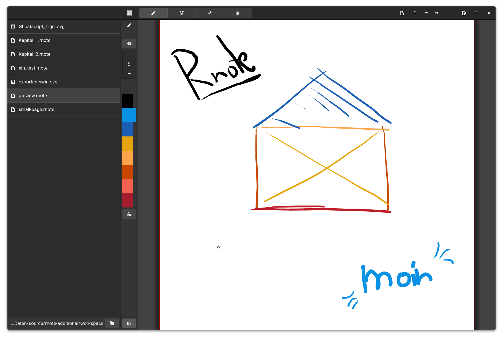

<div align="center">
</img>
</div>

# Rnote
A simple note taking application written in Rust and GTK4.

My motivation for this project is to create a simple but functional note taking application for freehand drawing or annotating pictures or documents. It eventually should be able to import / export various media file formats.  
One main consideration is that it is vector based, which should make it very flexible in editing and altering the contents.

**Disclaimer**  
This is my first Rust and GTK project and I am learning as I go along. Expect bugs and crashes. It also could blow up your computer. ;)

## Feature Ideas:
* Stroke history list widget
    * with the ability to move them up and down the history / layers
* Stroke trash restorer
    *  with a preview of the deleted strokes ( as gtk4::Textures )
* Dual sheets (e.g. one for imported pdfs and one for extra notes)

## To-Do
- [x] Switch geometry to [nalgebra](https://crates.io/crates/nalgebra) wherever possible. It can operate on f64 and has much more features than graphene.
- [ ] Template deduplication when loading in .rnote save files.
- [ ] PDF Import, Export and printing option
- [ ] PNG Import, Export
- [ ] Implement bezier curve stroke with variable stroke width (see this paper: [Quadratic bezier offsetting with selective subdivision](https://microbians.com/math/Gabriel_Suchowolski_Quadratic_bezier_offsetting_with_selective_subdivision.pdf))
- [ ]

## Screenshots
Rnote is a very early WIP project, so don't expect too much. :)



### Building with Flatpak
There is a flatpak manifest in `build-aux/com.github.felixzwettler.rnote.json`.

Use Gnome Builder or vscode with the flatpak extension to build and run the application for you. **This is the easiest and recommended way.**

Otherwise:

First the Gnome 40 SDK is needed:
```
flatpak install org.gnome.Sdk//40 org.freedesktop.Sdk.Extension.rust-stable//21.08 org.gnome.Platform//40
```

**Build**  
Building the app with flatpak is done with:
```
flatpak-builder --user flatpak-app build-aux/com.github.felixzwettler.rnote.json
```

Creating a repo:

```
flatpak-builder --user --repo=flatpak-repo flatpak-app build-aux/com.github.felixzwettler.rnote.json

```


**Install**  
Install to the system as user with:
```
flatpak-builder --user --install flatpak-app build-aux/com.github.felixzwettler.rnote.json
```

**Run**  
Then it can be run.
From the build directory:
```
flatpak-builder --run flatpak-app build-aux/com.github.felixzwettler.rnote.json rnote
```

Or if it is installed:
```
flatpak run com.github.felixzwettler.rnote
```

### Build with Meson
The flatpak manifest calls the meson build system to build the application.
If a native build is wanted, meson can be called directly.

Make sure `rustc` and `cargo` are installed. Then run:

```
meson setup --prefix=/usr _build
```
Meson will ask for the user password when needed.

To enable the development profile, set `-Dprofile=devel` as a parameter. Else the `default` profile will be set. ( This can be reconfigured later )

**Compile**  
Once the project is configured, it can be compiled with:

```
meson compile -C _build
```

The compiled binary should now be here: `./build/target/release/rnote`.

**Install**  
Installing the binary into the system can be done with:

```
meson install -C _build
```

**Test**  
Meson has some tests to validate the desktop, gresources, ... files.
```
meson test -v -C _build
```

This places the files in the specified prefix and their subpaths. The binary should now be in `/usr/bin` (and therefore in PATH)

**Reconfigure**  
reconfiguring the meson build files can be done with:

```
meson configure -Dprofile=default _build
```

For example if the profile needs to be changed.


**Uninstall**  
If you don't like rnote, or decided that is not worth your precious disk space, you can always uninstall it with:

```
sudo ninja uninstall -C _build
```